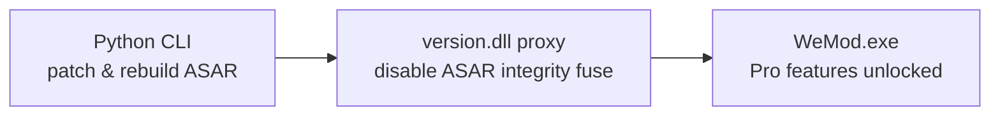

<div align="center">


# WeMod Enhancer

**Cross-platform patcher and ASAR-fuse proxy for Wand/WeMod's Electron client**

A dependency-free Python CLI that patches WeMod's Windows x86-64 Electron app in-place. It disables ASAR integrity, activates Pro features, kills auto-updates, blocks native mobile pairing, and enables F12 DevTools — all through a 4 KB C proxy DLL and standard-library Python. On Linux it cross-compiles with LLVM-MinGW and launches through Wine/Proton, with full Steam Deck support.

[](https://github.com/e-gleba/wemod_enhancer/actions/workflows/cmake_multi_platform.yml)
[](license.md)
[](https://cmake.org/)
[](https://en.cppreference.com/)
[](https://www.python.org/)
[](#linux-and-steam)

</div>

---

## Why not Wand-Enhancer?

The original [Wand-Enhancer](https://github.com/k1tbyte/Wand-Enhancer) is a 13K-star C#/.NET WPF application. It works — but it's a Windows-only GUI that requires .NET Framework 4.8, NuGet packages, Node.js, pnpm, Visual Studio 2022, and a GitHub Actions fork just to build. No prebuilt binaries. No Linux. No Steam Deck.

WeMod Enhancer is a ground-up rewrite that does the same core job with zero runtime dependencies and full cross-platform support:

| | **WeMod Enhancer** | **Wand-Enhancer** |
|:--|:-------------------|:-------------------|
| **Language** | C + Python (stdlib only) | C# / .NET / WPF |
| **Runtime deps** | None — Python stdlib + a 4 KB C DLL | .NET Framework 4.8 runtime |
| **Build deps** | CMake + compiler | CMake + Node.js + pnpm + VS 2022 + MSBuild + NuGet |
| **Build from source** | `python3 tools/wemod_enhancer.py build-dll` | Fork → GitHub Actions → download artifact |
| **Platform** | Windows, Linux, Steam Deck | Windows only |
| **Interface** | CLI — scriptable, automatable | WPF GUI — click-through wizard |
| **Binary size** | ~4 KB proxy DLL | Full .NET WPF application |
| **ASAR integrity bypass** | In-process fuse flip via `VirtualProtect` — walks memory for a 32-byte sentinel, flips Electron's fuse wire to `removed` | Same approach (shared heritage) |
| **Pro activation** | Intercepts `/v3/account` responses, injects `subscription: { period: "yearly", state: "active" }` | Same |
| **DevTools** | F12 hotkey hook on `browser-window-created` | Not available |
| **Disable updates** | `ACTION_CHECK_FOR_UPDATE` handler → no-op | Not available |
| **Disable mobile pairing** | `requestRemoteAuthCode()` → `Promise.reject` | Not available |
| **Remote web panel** | Not included | Built-in LAN HTTP/WebSocket server |
| **Custom script injection** | Not included | Bundled `.js` injection at patch time |
| **Fail-safe** | Fails closed on mismatched patches — no partial state | — |
| **Backup & restore** | Automatic, one-command restore | — |
| **License** | MIT | Apache-2.0 |

> WeMod Enhancer focuses on the core patching pipeline and does it with the smallest possible footprint. If you need the Remote Web Panel or custom script injection, Wand-Enhancer remains a solid choice — both projects can coexist.

## Quick Start

### From a release package (prebuilt DLL)

Download a release archive, extract it, and run:

```sh
# version.dll is bundled alongside the script — no CMake needed
python3 wemod_enhancer.py patch --install-dir "/path/to/wemod_bin"

# Restore originals at any time
python3 wemod_enhancer.py restore --install-dir "/path/to/wemod_bin"
```

### From source (build the DLL yourself)

```sh
# 1. Stop WeMod, then patch the install directory
python3 tools/wemod_enhancer.py patch --install-dir "/path/to/wemod_bin"

# 2. Restore originals at any time
python3 tools/wemod_enhancer.py restore --install-dir "/path/to/wemod_bin"

# 3. Build only the proxy DLL (no patching)
python3 tools/wemod_enhancer.py build-dll
```

Backups are created automatically before modification. If a client update changes minified JavaScript and a required patch no longer matches, the tool **fails closed** — no partial patches are applied.

### Install via CMake (build + install to a directory)

```sh
cmake --workflow --preset llvm-mingw-x86_64-full
cmake --install build/llvm-mingw-x86_64 --prefix ./dist
# dist/bin/ now contains both version.dll and wemod_enhancer.py
```

## Requirements

| Tool | Version | Notes |
|:-----|:--------|:------|
| **Python** | 3.11+ | Runs the patcher CLI |
| **CMake** | 3.31+ | Builds the proxy DLL (not needed with prebuilt releases) |
| **Ninja** | any | Build system generator (required for Clang preset) |
| **Windows** | — | MSVC (VS 2022) or Clang targeting MSVC ABI (`x86_64-pc-windows-msvc`) |
| **Linux** | — | LLVM-MinGW toolchain, auto-downloaded by CMake |

## Linux and Steam

For Steam Deck / Linux gaming, use the maintained [wemod-launcher](https://github.com/DeckCheatz/wemod-launcher):

```sh
# Install the launcher
git clone https://github.com/DeckCheatz/wemod-launcher "$HOME/wemod-launcher"
chmod +x "$HOME/wemod-launcher/wemod"

# Patch WeMod
python3 tools/wemod_enhancer.py patch \
  --install-dir "$HOME/wemod-launcher/wemod_data/wemod_bin"
```

Set your Steam game launch options to:

```sh
WINEDLLOVERRIDES="version=n,b" "$HOME/wemod-launcher/wemod" %command%
```

> **Why `version=n,b`?** Wine can satisfy `version.dll` with its builtin implementation even when the proxy exists beside `WeMod.exe`. The `n,b` override forces native-first loading with builtin fallback — without it, Wine loads only its builtin DLL and Electron rejects the modified ASAR.

For detailed diagnostics, log locations, and cleanup, see [Linux launch and debugging](docs/linux.md).

## How it works



The Python CLI backs up `app.asar`, extracts it, applies JavaScript patches (Pro activation, disable updates, DevTools F12), rebuilds the archive with fresh SHA-256 integrity, and installs the `version.dll` proxy. At runtime the proxy walks WeMod's process memory for a 32-byte sentinel, locates Electron's fuse wire, and flips the ASAR-integrity fuse to `removed` via `VirtualProtect` — all in-process, no external debugger required.

## Development

The project originated as a focused port of the native ASAR-fuse proxy and JavaScript patches from [Wand-Enhancer](https://github.com/k1tbyte/Wand-Enhancer). Development proceeded by:

1. Replacing the generic C++ template with a Windows x86-64 proxy DLL
2. Adding Linux-to-Windows LLVM-MinGW and native Windows MSVC builds
3. Porting backup, patch, restore, and ASAR handling to one standard-library Python CLI
4. Validating behavior against the original AsarSharp pickle and SHA-256 integrity implementation
5. Diagnosing Proton startup with `PROTON_LOG`, `WINEDEBUG`, and DLL-load traces
6. Documenting Wine's required native-first `version.dll` override

The CMake and CI scope is intentionally limited to Windows x86-64. Linux is a host and runtime environment, not a native DLL target.

### Code Quality

```sh
cmake --build build/gcc --target format   # clang-format + cmake-format
cmake --build build/gcc --target tidy     # clang-tidy
cmake --build build/gcc --target cpplint  # cppcheck/cpplint
```

Pre-commit hooks enforce formatting and linting. Run `pre-commit install` once after cloning.

## License

[MIT](license.md) — © 2026 Evgeniy Gleba
