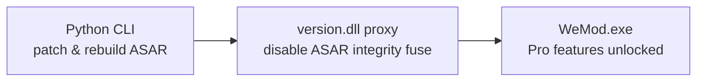

<div align="center">


# WeMod Enhancer

**The original WeMod app — Pro unlocked — on Steam Deck & Linux**

One command patches the WeMod client running inside [wemod-launcher](https://github.com/DeckCheatz/wemod-launcher): Pro subscription active, auto-updates disabled, F12 DevTools, no mobile pairing nag. Zero runtime dependencies — standard-library Python plus a 4 KB C proxy DLL. Windows works too.

[](https://github.com/e-gleba/wemod_enhancer/actions/workflows/cmake_multi_platform.yml)
[](license.md)
[](https://cmake.org/)
[](https://en.cppreference.com/)
[](https://www.python.org/)
[](#steam-deck--linux)

</div>

---

## Steam Deck & Linux

WeMod has no Linux build. [wemod-launcher](https://github.com/DeckCheatz/wemod-launcher) fixes that by running the official Windows client through Proton — and WeMod Enhancer is the missing piece that unlocks Pro on top of it.

```sh
# 1. Install the launcher (runs the original WeMod via Proton)
git clone https://github.com/DeckCheatz/wemod-launcher "$HOME/wemod-launcher"
chmod +x "$HOME/wemod-launcher/wemod"

# 2. Launch your game once through the launcher, then patch the WeMod install
python3 wemod_enhancer.py patch \
  --install-dir "$HOME/wemod-launcher/wemod_data/wemod_bin"
```

Set your Steam launch options for the game:

```sh
WINEDLLOVERRIDES="version=n,b" "$HOME/wemod-launcher/wemod" %command%
```

> **Why `version=n,b`?** Wine can satisfy `version.dll` with its builtin implementation even when the proxy exists beside `WeMod.exe`. The `n,b` override forces native-first loading with builtin fallback — without it, Wine loads only its builtin DLL and Electron rejects the modified ASAR.

Done. WeMod starts with your game, Pro features active. For diagnostics, log locations, and cleanup, see [Linux launch and debugging](docs/linux.md).

## Windows

Download a release archive (prebuilt `version.dll` included — no CMake needed), extract, and run:

```sh
# Stop WeMod, then patch the install directory
python3 wemod_enhancer.py patch --install-dir "C:/path/to/WeMod"
```

## Restore

Originals are backed up automatically before any modification. One command reverts everything:

```sh
python3 wemod_enhancer.py restore --install-dir "/path/to/wemod_bin"
```

If a WeMod update changes the minified client code and a required patch no longer matches, the tool **fails closed** — no partial patches, no broken install.

## What you get

| Feature | Details |
|:--------|:--------|
| **Pro activation** | Intercepts `/v3/account` responses, injects `subscription: { period: "yearly", state: "active" }` |
| **ASAR integrity bypass** | In-process fuse flip via `VirtualProtect` — walks memory for a 32-byte sentinel, flips Electron's fuse wire to `removed` |
| **F12 DevTools** | Hotkey hook on `browser-window-created` |
| **No auto-updates** | `ACTION_CHECK_FOR_UPDATE` handler → no-op — your patch survives until you say otherwise |
| **No mobile pairing** | `requestRemoteAuthCode()` → `Promise.reject` |
| **Backup & restore** | Automatic, one command |
| **Fail-safe** | All-or-nothing patching — never a half-patched client |

## How it works



The Python CLI backs up `app.asar`, extracts it, applies the JavaScript patches, rebuilds the archive with fresh SHA-256 integrity, and installs the `version.dll` proxy. At runtime the proxy walks WeMod's process memory for a 32-byte sentinel, locates Electron's fuse wire, and flips the ASAR-integrity fuse to `removed` via `VirtualProtect` — all in-process, no external debugger required.

## Requirements

| Tool | Version | Notes |
|:-----|:--------|:------|
| **Python** | 3.11+ | Runs the patcher CLI — standard library only |
| **CMake** | 3.31+ | Builds the proxy DLL (not needed with prebuilt releases) |
| **Ninja** | any | Build system generator |
| **Windows** | — | MSVC (VS 2022) or Clang targeting MSVC ABI (`x86_64-pc-windows-msvc`) |
| **Linux** | — | LLVM-MinGW toolchain, auto-downloaded by CMake |

## Build from source

```sh
# Build only the proxy DLL (no patching)
python3 tools/wemod_enhancer.py build-dll

# Or full CMake workflow: build + install both version.dll and wemod_enhancer.py
cmake --workflow --preset llvm-mingw-x86_64-full
cmake --install build/llvm-mingw-x86_64 --prefix ./dist
# dist/bin/ now contains a self-contained patcher — Python is all you need
```

## Development

```sh
cmake --build build/gcc --target format   # clang-format + cmake-format
cmake --build build/gcc --target tidy     # clang-tidy
cmake --build build/gcc --target cpplint  # cppcheck/cpplint
```

Pre-commit hooks enforce formatting and linting. Run `pre-commit install` once after cloning.

The CMake and CI scope is intentionally limited to Windows x86-64. Linux is a host and runtime environment, not a native DLL target.

## Why not Wand-Enhancer?

The original [Wand-Enhancer](https://github.com/k1tbyte/Wand-Enhancer) is a 13K-star C#/.NET WPF application. It works — but it's a Windows-only GUI that requires .NET Framework 4.8, NuGet packages, Node.js, pnpm, Visual Studio 2022, and a GitHub Actions fork just to build. No prebuilt binaries. No Linux. No Steam Deck.

WeMod Enhancer is a ground-up rewrite that does the same core job with zero runtime dependencies and full cross-platform support:

| | **WeMod Enhancer** | **Wand-Enhancer** |
|:--|:-------------------|:-------------------|
| **Language** | C + Python (stdlib only) | C# / .NET / WPF |
| **Runtime deps** | None — Python stdlib + a 4 KB C DLL | .NET Framework 4.8 runtime |
| **Build deps** | CMake + compiler | CMake + Node.js + pnpm + VS 2022 + MSBuild + NuGet |
| **Build from source** | `python3 tools/wemod_enhancer.py build-dll` | Fork → GitHub Actions → download artifact |
| **Platform** | Steam Deck, Linux, Windows | Windows only |
| **Interface** | CLI — scriptable, automatable | WPF GUI — click-through wizard |
| **Binary size** | ~4 KB proxy DLL | Full .NET WPF application |
| **ASAR integrity bypass** | In-process fuse flip via `VirtualProtect` | Same approach (shared heritage) |
| **Pro activation** | Intercepts `/v3/account` responses | Same |
| **DevTools** | F12 hotkey hook | Not available |
| **Disable updates** | `ACTION_CHECK_FOR_UPDATE` → no-op | Not available |
| **Disable mobile pairing** | `requestRemoteAuthCode()` → reject | Not available |
| **Remote web panel** | Not included | Built-in LAN HTTP/WebSocket server |
| **Custom script injection** | Not included | Bundled `.js` injection at patch time |
| **Fail-safe** | Fails closed on mismatched patches | — |
| **Backup & restore** | Automatic, one-command restore | — |
| **License** | MIT | Apache-2.0 |

> WeMod Enhancer focuses on the core patching pipeline with the smallest possible footprint. If you need the Remote Web Panel or custom script injection on Windows, Wand-Enhancer remains a solid choice — both projects can coexist.

## License

[MIT](license.md) — © 2026 Evgeniy Gleba
